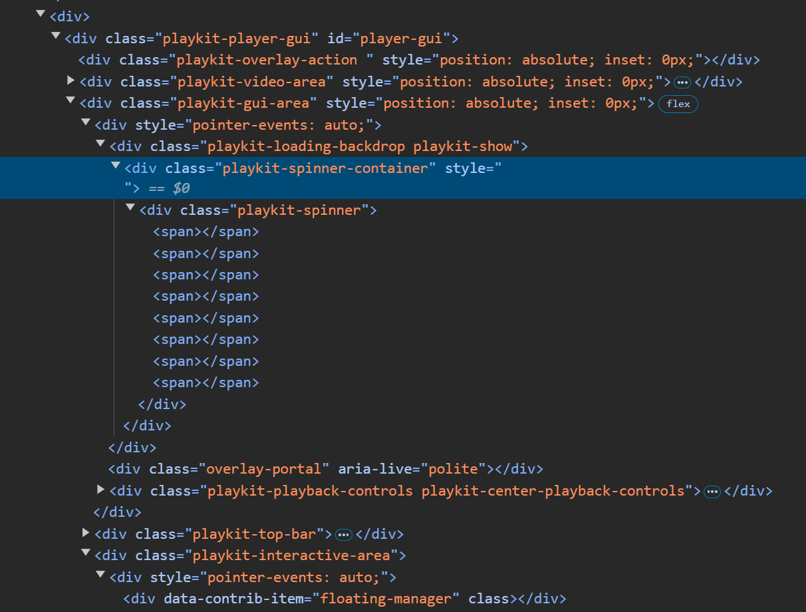
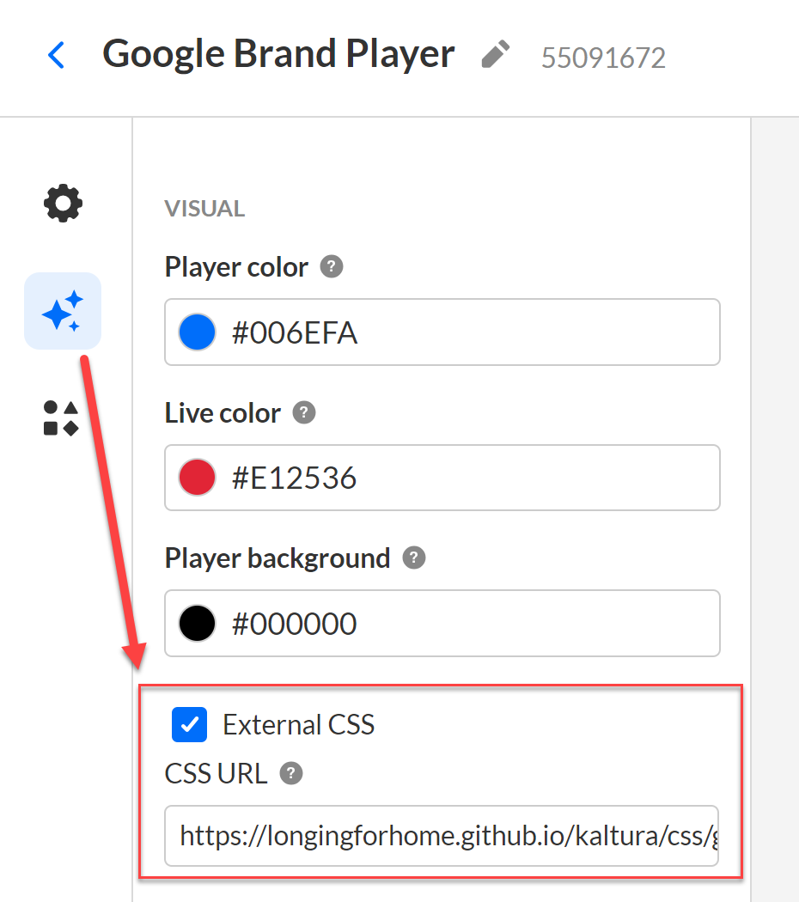
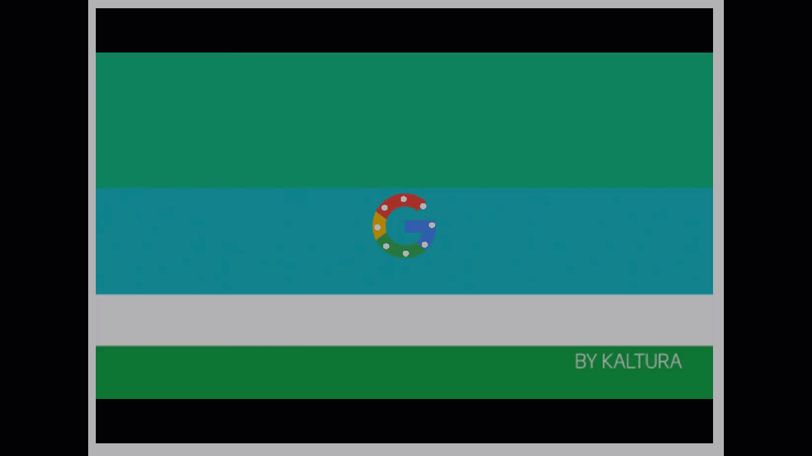

# Loading Spinner Customizations
If you've wondered about how to customize that little Kaltura logo loading spinner on the player, then you've come to the right spot.  We'll cover some examples of things you can do, but before we dive in, there is some baseline information that will be helpful in understanding what is possible.

## Reference
Before we go about customizing the loading spinner, it's important to understand the underlying HTML elements, and existing CSS classes.  The elements consist of a parent `<div>`, child `<div>`, and 8 child `<span>`s.

* At the top level, we have a `<div>` element with the class "playkit-spinner-container".  This is the outer wrapper for the spinner.  Note that this wrapper `<div>` doesn't actually spin.
  * 	
* Under that, we have a child `<div>` element with the class "playkit-spinner".  This is the `<div>` that spins.
  * 
* And under that child `<div>`, we have 8 child `<span>` elements with no class.  These are the spinning dots that you see.  Note that there are no classes for these, so if you want to target them to change colors or other attributes independently, you'll need to use :nth-child CSS selectors.
  * 
Now that you know the elements and classes, you'll also need to know where to configure the player to have it load your custom CSS.  In the player studio in the KMC, under the 'Visual' tab, you'll find the 'External CSS' checkbox and url configuration:

After enabling the 'External CSS' checkbox, then enter the url where you are hosting your custom CSS, and Save.  NOTE: after saving the config, it can sometimes take up to 10 minutes before the CDN cache where your player is stored refreshes.

## Examples
Now that you understand the basic structure and how to configure, then we can go about customizing.  
### Google Spinner Example
Let's create an example where we set the spinner background to have the Google logo, and change the spinner dots to white.  To do this, we'll need to set the background of the parent wrapper `<div>` (remember, that's the one that does NOT spin).  Then we'll just change the color of the `<span>`s to white.  Your CSS will look like this:
```css
div.playkit-spinner > * {
    background-color: white !important; /* can change to whatever hex/rgb value you want for the color of the dots */
}

div.playkit-spinner-container {
    background-image: url(https://cfvod.kaltura.com/p/5954112/sp/595411200/raw/entry_id/1_ysx0ezhr/version/100001); /* change this url to whatever hosted image you want to use.  recommended dimensions are 64x64 */
    background-repeat: no-repeat;
    background-position: center;
}  
```
This should render something like this:


## Caveats
Things worth mentioning as you embark on this journey:
* When using externally hosted CSS for customizations, the player tries to asynchronously load the CSS when it's rendering.  If the spinner renders before the CSS finishes loading, then you may see a short blip of the original spinner until the CSS is loaded and applied.

